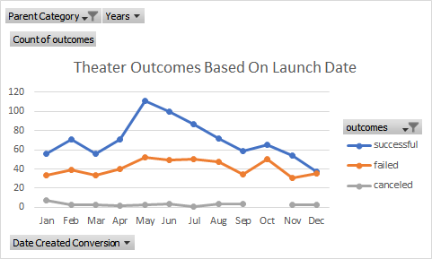
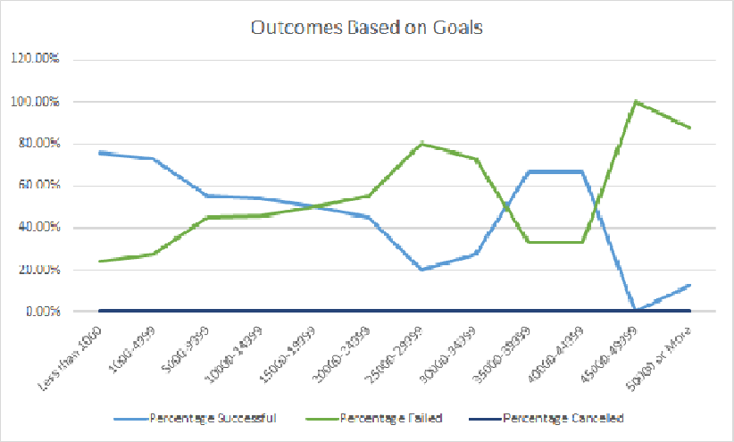

# Analysis of Theater Attendance Vs. Fundraising Success

## Overview and Background

The purpose of this challenge was to ascertain the relationship between outcomes in theater attendance versus corresponding Kickstarter campaign successes and failures while considering the launch date of each play. Additionally, we were purposed with finding the percentage of successful/failed theater play within each fundraising goal bracket.
## Analysis and Challenges

First, we looked at theater outcomes based on launch date. Creating a Pivot Table and Chart using data from the worksheet in Kickstarter. In the X Axis the time of the season interacted with the Y axis which was number of occurrences of success and failure. Using the filter in the parent category to only look at Theater outcomes. From there a PivotChart was created showing how these datasets interact. A major roadblock here was the skew that was created by not deselecting blank or other unnecessary data. I found myself not catching that after many attempts additionally revisiting what values and filters are for chart creation.
## Theater_Outcomes_vs_Launch

The second set of data we analyzed was the relationship between Fundraising Goal and the percentage of successes and failures that fell in each fundraising goal bracket. To do that a table was created using Count if and Sum All's to determine the percentage of success vs failure in each goal bracket. From there a line graph was created with the X Axis containing the Fundraising Goal Brackets and the Y Axis displaying the percentage of the occurrences. During this exercise I was confounded by trying to find the proper line chart that would best display the information and overlap. Choosing the proper line chart makes the difference in what you display.
## Outcomes_Vs _Goals

### Results
Theater Outcomes based on launch date when analyzed gave the reader two takeaways. The first being that launch date does not affect the outcomes of failed Kickstarter campaigns. The second being that there were far more successful outcomes if the launch date occurred in the spring.

Outcomes versus goals showed us the direct relationship when comparing the relationship two parts of a whole (percentages) relate to each other. The higher percentage of occurrences of success always meant a direct lower percentage of occurrences of failures.

Summary Recommendations would include launching the play in Spring and keep the budget equal or below $15,000. If considering expansion to Great Britain, we would need additional analysis for Great Britain. 
